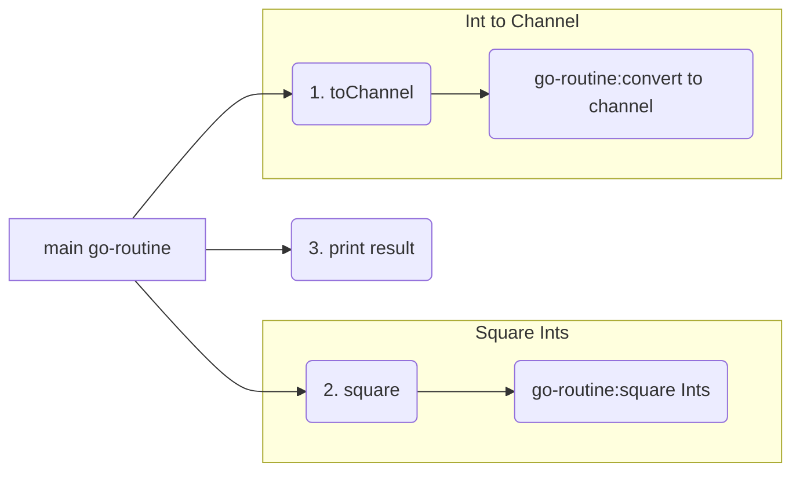

# syncronouse communication between go-routines

* Channel created by toChannel() passed to go-routine:squareInts through square()
* go-routine:squareInts reads each element from channel and square it and drop to another channel(ch2)
* Main go-routine reads from channel(c2) from square and write to stdout
